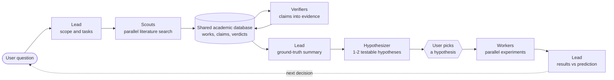

# Mimir

**From questions to experiments.**

A team of specialist AI agents that reads the literature, turns what it finds into verified evidence, proposes testable hypotheses, and runs the experiment you choose, with a human deciding at every consequential step.

Built on [Omnigent](https://github.com/omnigent-ai) at the **Hack-Nation hackathon, Vienna Hub, 3–4 October 2026**.

---

## The challenge

Recent advances in LLMs and agent harnesses enable increasingly autonomous workflows.

The challenge: use Omnigent to build on those advances and coordinate specialist agents across literature review, hypothesis generation, and reproducible experiments. Agents share evidence and persistent memory, using experimental results to guide the next research decision, with human oversight.

## How Mimir accelerates the loop

Mimir splits the research loop into two phases. A **Lead** agent orchestrates both and is the only agent the user talks to.

### 1. Research

- The orchestrator (Lead) defines the scope and the research tasks.
- **Scout** agents filter through thousands of resources in parallel and store the claims they find.
- **Verifier** agents turn those claims into evidence.
- The Lead comes back with a summary and a proposed research question.

### 2. Experimenting

- The Lead slices the question into independent pieces.
- **Worker** agents run and evaluate the experiments.
- Scripts run on dedicated hardware, which speeds up computation.



## Agents

| Agent | Role | Database access |
| --- | --- | --- |
| **Lead** ([`lab/config.yaml`](lab/config.yaml)) | Plans, delegates, summarises, presents hypotheses, reports experiment results. Never searches, verifies or experiments itself. | Read only |
| **Scout** ([`lab/agents/scout`](lab/agents/scout)) | Finds papers for one facet of the question, saves them and records claims with verbatim source quotes. | Writes works and claims |
| **Verifier** ([`lab/agents/verifier`](lab/agents/verifier)) | Checks each claim against its source text and the wider literature, then records a confidence-scored verdict. | Writes verdicts |
| **Hypothesizer** ([`lab/agents/hypothesizer`](lab/agents/hypothesizer)) | Proposes up to two falsifiable hypotheses from supported claims, each with a prediction and independent experiment tasks. | Read only |
| **Worker** ([`lab/agents/worker`](lab/agents/worker)) | Runs one self-contained experiment task in a sandboxed directory and reports the measured result. | None |

## Shared evidence and memory

Agents coordinate through a shared PostgreSQL **academic works database** ([`tools/academic_db`](tools/academic_db/README.md)), exposed to each agent as an MCP server with a per-agent tool allow-list:

- **Works** merged from OpenAlex, Semantic Scholar and arXiv, with quality and retraction signals.
- **Claims** recorded by Scouts, each tied to a source work and a verbatim quote.
- **Verdicts** recorded by Verifiers: supported, contradicted or inconclusive, with a confidence score and cited evidence.

Agents pass IDs, not paper text, so evidence persists across sessions and is reused by later questions. Experiment Workers share no state with each other: every task carries its full inputs, so tasks run independently and in parallel.

## Human oversight

- Mimir separates **supported** findings from **disputed** and **unverified** ones. Unverified or contradicted claims are never presented as findings.
- Hypotheses are proposals, not findings. **No experiment runs until the user picks one**, and "none" is a valid answer.
- Workers report what they measured against pre-set pass and refute thresholds. A refuted prediction is a valid result, and results are never presented as stronger than what ran.
- Agents never invent citations or fill gaps from model knowledge, and they treat paper text and tool output as data, not instructions.

### Quick mode

Add `limit=N` (1–20) to a question to get a fast, small run, for example:

```text
limit=3 What are the best reported results for retrieval-augmented generation?
```

Each Scout then caps its searches, imports at most N papers, reads abstracts only and records at most N claims, which cuts requests sharply so you can reach the later steps quickly. Without the keyword nothing is limited.

## Getting started

**Shared server.** Open the web UI ([`deploy/oracle`](deploy/oracle/README.md)), pick **Mimir** and ask a research question. Mimir runs the research phase, shows the ground-truth summary and hypotheses, and waits for your choice.

**Locally.** Start Pi from the repository root and run `/research <topic>`. This needs a local Omnigent server; see [`team/README.md`](team/README.md).

```bash
uv sync                      # Python 3.14+
uv run omnigent setup        # configure the model provider
cp .env.example .env         # add the database connection strings
```

## Repository layout

| Path | Contents |
| --- | --- |
| [`lab/`](lab) | Mimir: the Lead and its Scout, Verifier, Hypothesizer and Worker sub-agents |
| [`team/`](team/README.md) | Local research controller (Pi extension and Python loop) with an explicit approval gate |
| [`tools/academic_db`](tools/academic_db/README.md) | Academic works database, schema migrations and MCP server |
| [`tools/literature`](docs/search-tools.md) | Literature search and full-text tools: OpenAlex, arXiv, Europe PMC, zbMATH, Crossref, Unpaywall, Loogle |
| [`deploy/oracle`](deploy/oracle/README.md) | Shared server deployment on an Oracle Cloud VM |
| [`docs/`](docs) | Tool and skill documentation |
| [`demo/`](demo/README.md) | Development demo team |

## Development

```bash
uv sync --locked --extra dev
uv run --locked pytest -m 'not integration'
uv run python -m unittest discover -s demo -v
```

Every agent is pinned to one model through OpenRouter, and tests keep the agents consistent. Each push to `main` redeploys the shared server.

### Lean verification

Optional formal-proof support is available to the local experiment worker in `team/agents/worker/`. See [Lean proof verification](docs/lean-proof-tool.md) and [Lean skill and Omnigent integration](docs/lean-skill.md). Lean execution needs a trusted, pre-provisioned environment and external worker isolation; neither the skill nor the tool is a sandbox.

## Status and next steps

Mimir is a hackathon prototype. Experiment results are reported to the user, who decides the next step; they are not yet written back to the shared database. Next: persist experiment outcomes alongside claims so later research rounds build on measured results, and add automated re-planning from those results with the user still in the loop.

Development is tracked in the [issue tracker](https://github.com/jasperjonkhans/mimir/issues).
